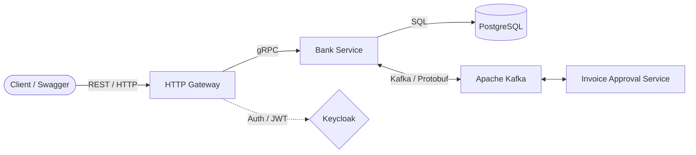

# 🏦 Banking & Invoice Management System


Микросервисная бэкенд-система для управления банковскими счетами, обработки инвойсов и проведения транзакций. Проект
демонстрирует применение современных архитектурных паттернов, асинхронного взаимодействия и принципов Observability.

## 📑 Оглавление

- [О проекте](#-о-проекте)
- [Функциональные возможности](#-функциональные-возможности)
- [Архитектура и Технологии](#-архитектура-и-технологии)
- [Структура проекта](#-структура-проекта)
- [Запуск проекта](#-запуск-проекта)
- [Тестирование](#-тестирование)

---

## 🚀 О проекте

Система состоит из сервиса бизнес-логики и HTTP-gateway. Она позволяет пользователям управлять своими финансами,
выставлять и оплачивать инвойсы, а также включает интеграцию с внешним сервисом согласования инвойсов для корпоративных
клиентов.

### Основные фичи:

- **Разделение API**: Внутреннее общение по `gRPC`, внешнее REST API через `HTTP Gateway`.
- **Ролевая модель**: Интеграция с Keycloak (JWT). Администраторы и обычные пользователи.
- **Event-Driven**: Асинхронное взаимодействие через Kafka.
- **Observability**: Полное покрытие метриками, распределенным трейсингом и структурным логированием.
- **Запуск и оркестрация:** Использование **.NET Aspire**. Вместо классического `docker-compose`, C#-проект оркестрирует
  запуск как Docker-контейнеров, так и самих .NET-сервисов, автоматически связывая их между собой и предоставляя
  dashboard.

---

## ✨ Функциональные возможности

### 💳 Управление счетами

- Создание счетов (только для роли `Admin`).
- Разделение счетов на **обычные** и **корпоративные**.
- Лимит: не более 5 счетов на одного пользователя.
- Операции пополнения и снятия средств (с проверкой прав владения счетом).

### 🧾 Управление инвойсами

- Жизненный цикл инвойса: `Создан` ➡️ `Согласован`/`Отклонен` ➡️ `Оплачен`/`Отозван`.
- Выставление инвойса с одного счета на другой.
- Процесс **согласования** для корпоративных счетов. Бухгалтер назначается на инвойс и принимает решение.
- Пагинация и фильтрация при просмотре входящих/исходящих инвойсов.

### 📊 История операций

- Сохранение истории транзакций с использованием полиморфных моделей.
- Хранение `payload` в PostgreSQL в формате `jsonb`.

---

## 🛠 Архитектура и Технологии



## 🛠 Стек технологий

- **Платформа:** .NET 10 / C#
- **API:** gRPC (внутренний сервис), ASP.NET Core Web API (HTTP-гейтвей), Swagger
- **База данных:** PostgreSQL (через `Itmo.Dev.Platform.Persistence`)
- **Брокер сообщений:** Apache Kafka (`Itmo.Dev.Platform.Kafka`)
- **Авторизация:** Keycloak (JWT, OAuth 2.0)
- **Оркестрация & Observability:** .NET Aspire, OpenTelemetry, Serilog, Grafana, Prometheus
- **Тестирование:** xUnit, Moq, FluentAssertions, TestContainers, WebApplicationFactory

---

## 📁 Структура проекта

```text
├── src/
│   ├── gateway/        # HTTP gateway (REST API, Swagger, JWT Auth, gRPC Client)
│   ├── service/        # Основной сервис (gRPC Server, бизнес-логика, Kafka)
│   └── aspire/        # .NET Aspire (Оркестрация контейнеров и сервисов)
│
├── tests/
│   ├── UnitTests/      # Модульные тесты с использованием Moq
│   └── Integrations/   # Интеграционные тесты с TestContainers
└── sql/                # Datafix скрипты
```

## ⚙️ Запуск проекта

### Требования

- **.NET 8 SDK**
- **Docker Desktop** (или Docker Engine + Compose)

### Инструкция

1. **Запуск приложения через Aspire:**
   Перейдите в папку с AppHost проектом и запустите:

```bash
  dotnet run --project src/aspire/AppHost.csproj
```

2. **Доступ к панели Aspire:**
   После запуска в консоли появится ссылка на Aspire Dashboard.

3. **Документация API:**
   Доступна через Swagger на поднятом порту HTTP Gateway.

## 🧪 Тестирование

Проект покрыт модульными и интеграционными тестами. Интеграционные тесты работают в реалистичном окружении без
использования моков (применяется **Testcontainers** для поднятия БД в Docker и **WebApplicationFactory**).

Запуск всех тестов:

```bash
dotnet test
```